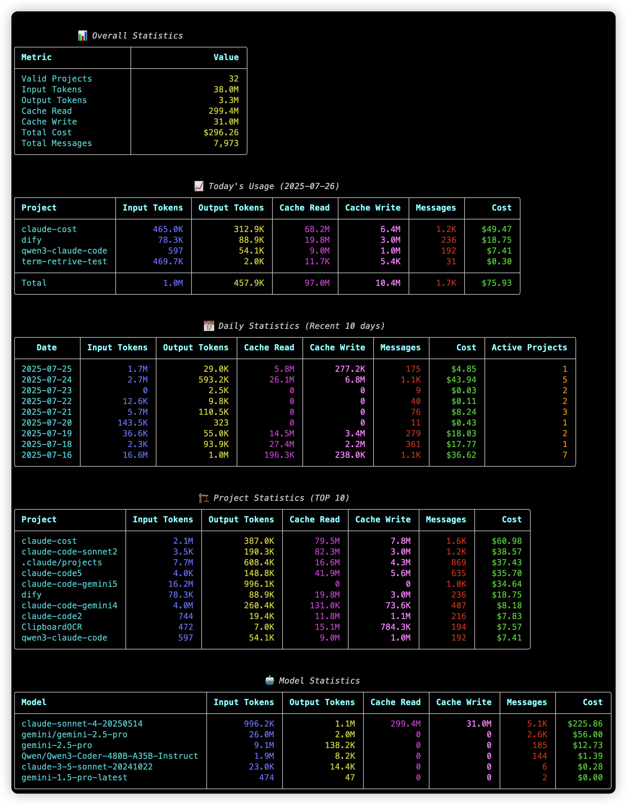

# Claude Cost Analyzer

A Python tool for analyzing Claude Code usage history, calculating token consumption and costs across projects and time periods.



## Features

- **Multi-model Support**: Claude Sonnet, Opus, Gemini models with accurate pricing
- **Comprehensive Analytics**: Daily usage trends, project rankings, model performance, and cost breakdowns  
- **Smart Display**: Automatically hides empty sections and optimizes long project paths
- **Model Insights**: Individual model consumption tracking with cost ranking (shown when using 2+ models)
- **Data Export**: JSON export for further analysis
- **Time Zone Handling**: Converts UTC timestamps to local time for accurate daily statistics

## Installation

### Requirements
- Python 3.8+
- Dependencies: `rich`, `pyyaml`

### Quick Setup

```bash
# Install dependencies
pip install rich pyyaml

# Or using uv (recommended)
uv pip install rich pyyaml
```

## Usage

### Basic Usage

```bash
# Analyze with default settings
python main.py

# Specify custom data directory
python main.py --data-dir /path/to/.claude/projects
```

### Advanced Options

```bash
# Customize display limits
python main.py --max-days 7 --max-projects 5

# Show all data
python main.py --max-days 0 --max-projects 0

# Display costs in Chinese Yuan (CNY)
python main.py --currency CNY

# Use custom exchange rate
python main.py --currency CNY --usd-to-cny 7.3

# Export to JSON
python main.py --export-json report.json

# Debug mode
python main.py --log-level DEBUG
```

## Output Sections

The tool displays up to 5 main sections:

1. **Overall Statistics**: Total projects, tokens, and costs
2. **Today's Usage**: Current day consumption by project (shown only when active)
3. **Daily Statistics**: Historical trends (shown only when historical data exists)
4. **Project Rankings**: Top projects by cost
5. **Model Statistics**: Individual model consumption and ranking (shown when using 2+ models)

## Model Pricing

Configure model pricing in `model_pricing.yaml`:

```yaml
pricing:
  sonnet:
    input_per_million: 3.0
    output_per_million: 15.0
    cache_read_per_million: 0.3
    cache_write_per_million: 3.75

  gemini-2.5-pro:
    # Multi-tier pricing example
    tiers:
      - threshold: 200000    # ≤200K tokens
        input_per_million: 1.25
        output_per_million: 10.0
      - # >200K tokens (unlimited tier)
        input_per_million: 2.50
        output_per_million: 15.0

  qwen3-coder:
    # CNY pricing example
    currency: "CNY"
    tiers:
      - threshold: 32000     # ≤32K tokens
        input_per_million: 4.0
        output_per_million: 16.0
      - threshold: 128000    # ≤128K tokens
        input_per_million: 6.0
        output_per_million: 24.0
      - threshold: 256000    # ≤256K tokens
        input_per_million: 10.0
        output_per_million: 40.0
      - # >256K tokens (unlimited tier)
        input_per_million: 20.0
        output_per_million: 200.0

currency:
  usd_to_cny: 7.3
  display_unit: "USD"
```

## Command Line Options

| Option | Default | Description |
|--------|---------|-------------|
| `--data-dir` | `~/.claude/projects` | Claude projects directory |
| `--max-days` | `10` | Days to show in daily stats (0=all) |
| `--max-projects` | `10` | Projects to show in rankings (0=all) |
| `--currency` | `USD` | Display currency (USD/CNY) |
| `--usd-to-cny` | `7.0` | Exchange rate for CNY conversion |
| `--log-level` | `WARNING` | Logging level |
| `--export-json` | - | Export results to JSON file |

## Data Sources

The tool analyzes JSONL files in your Claude projects directory, typically located at:
- **macOS**: `~/.claude/projects`
- **Linux**: `~/.claude/projects`  
- **Windows**: `%USERPROFILE%\.claude\projects`

## Contributing

Contributions welcome! Please feel free to submit issues and pull requests.

## License

MIT License - see [LICENSE](LICENSE) file for details. 